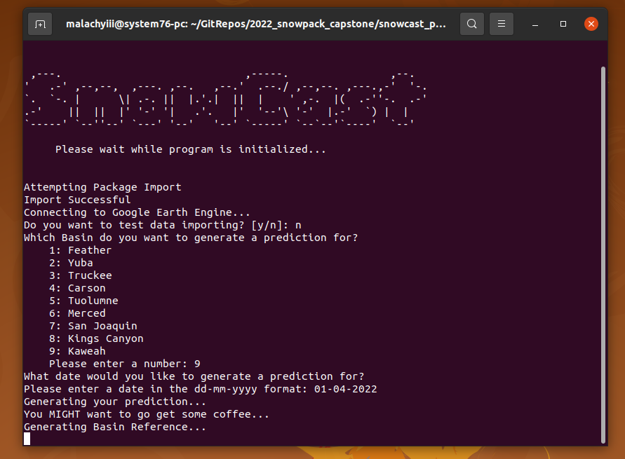

# Our Solution

Utilizing publicly available datasets, this project aimed to create a tool that would be able to provide accurate estimates of the Snow Water Equivalent (SWE) for 9 large basins in the Sierra Nevada Mountains at a 1km resolution. 

By using public datasets as inputs for our model, we aim to replicate costly surveying techniques at little to no cost. Our hope is that the tool we created can be utilized by environmental scientists and water planners to study the snowpack and steward California's water supply into the future.

# Our Tool

  

Screenshot of the Snowcast Tool

Our tool is deployed as a command line interface program. Simple to install, and intuitive to use, the SnowCast tool abstracts away all of the underlying processes. All the user needs to do is select an area and date to predict, then wait!

## Under the Hood

The Snowcast tool follows a very simple process to make predictions.

<ul>
    <li>Firstly, the tool asks for user input on the basin of interest, and the date.</li>
    <li>After receiving this information, the tool will chop the basin of interest up into 1km x 1km squares</li>
    <li>One square at a time, the tool will collect the relevant data, holding it in the temporary memory, and use that data to make predictions</li>
    <li>Once all squares are complete, they are stitched back together into a reference image and a .csv file of the data.</li>
</ul>

To see the code and development process, see the <a href="https://github.com/Seiris21/ucb2022.snowcast">git repo</a>. Many of the functions used in the code are available for use or modification in the bespoke <a href="https://github.com/Malachyiii/snowcast_package">python package</a> that supports the tool.

## Installation and Usage:

Setting up and running the SnowCast tool is incredibly easy, with only 5 steps to making your first prediction

Steps:
<ol>
    <li>Clone the <a href="hhttps://github.com/Seiris21/ucb2022.snowcast">git repo</a></li>
    <li>Download the  <a href="https://github.com/Malachyiii/snowcast_package">python package</a> with `pip install snowcast-Malachyiii`</li>
    <li>Open a terminal and navigate to the prediction module subfolder</li>
    <li>Run the tool with `python3 SnowCast.py`</li>
    <li>Enter the basin and date you want to make a prediction for</li>
</ol>

That's all there is to it! Watch the short installation guide and demo below to see a demonstration.

    <iframe width="560" height="315" src="https://www.youtube.com/embed/CwJyJ6Lwvjg" title="Snowcast Tutorial" frameborder="0" allow="accelerometer; autoplay; clipboard-write; encrypted-media; gyroscope; picture-in-picture" allowfullscreen></iframe>

## Tool Datasets:

The Snowcast prediction tool utilizes three different types of datasets.

<ol>
    <li>Airborne flyover data from the Airborne Snow Observatory was utilized as the target variable</li>
    <li>Satellite imagery from the Sentinel, MODIS, and Copernicus datasets</li>
    <li>Weather data obtained from GRIDMET</li>
</ol>

All of these datasets can be accessed below, and are available on Google Earth Engine or Microsoft Planetary Computer

### Target Variable

<a href="https://nsidc.org/data/aso">Airborne Snow Observatory</a>

### Satellite Imagery and Weather Assets

<a href="https://developers.google.com/earth-engine/datasets/catalog/COPERNICUS_S1_GRD">Sentinel-1 SAR GRD</a>

<a href="https://developers.google.com/earth-engine/datasets/catalog/sentinel-2">Sentinel-2 MSI</a>

<a href="https://developers.google.com/earth-engine/datasets/catalog/modis">MODIS Terra and Aqua Snowcover Data</a>

<a href="https://planetarycomputer.microsoft.com/dataset/cop-dem-glo-30">Copernicus 30m Digital Elevation Model</a>

<a href="https://developers.google.com/earth-engine/datasets/catalog/IDAHO_EPSCOR_GRIDMET">GRIDMET Meteorological Dataset</a>

# Model Results and Accuracy Measures

Our model was able to achieve a weighted average Root Mean Squared Error of 8" compared to the most recent ASO flyover. The accuracy varied by the basin as can be seen in the table below. 

Since our model predicts at a coarser 1km x 1km resolution than the orginial ASO data, Gaussian Smoothing was applied to the predictions. This allows each pixel of the image to be influenced by the value of the pixels around it. With Gaussian Smoothing we were able to achieve a Root Mean Squared Error of 7.5".

For specific details about model accuracy, errors, and upcoming improvements, please see the <a href="https://docs.google.com/document/d/1b_gI8lQ0ZhayQcq4T0wT4w9wVk4rD281uSmRsbcSRRc/edit?usp=sharing">supporting paper</a>

### Table of Results by Basin

| Basins (N-S) | Basin Size (km^2) | RMSE Observed | Smoothed RMSE Observed |
| --- | --- | --- | --- | --- |
| Feather | 8371 | 2.733" | 2.686" |
| Yuba | 2203 | 7.626" | 7.010" |
| Truckee | 2915 | 10.456" | 9.442" |
| Carson | 1478 | 7.710" | 7.343" |
| Tuolumne | 2921 | 9.501" | 9.497" |
| Merced | 1711 | 6.888" | 5.751" |
| San Joaquin | 4242 | 8.837" | 7.637" |
| Kings Canyon | 3464 | 18.411" | 17.485" |
| Kaweah | 1451 | 5.300" | 5.120" |
| **Overall** | **28756** | **8.000"** | **7.452"** |
