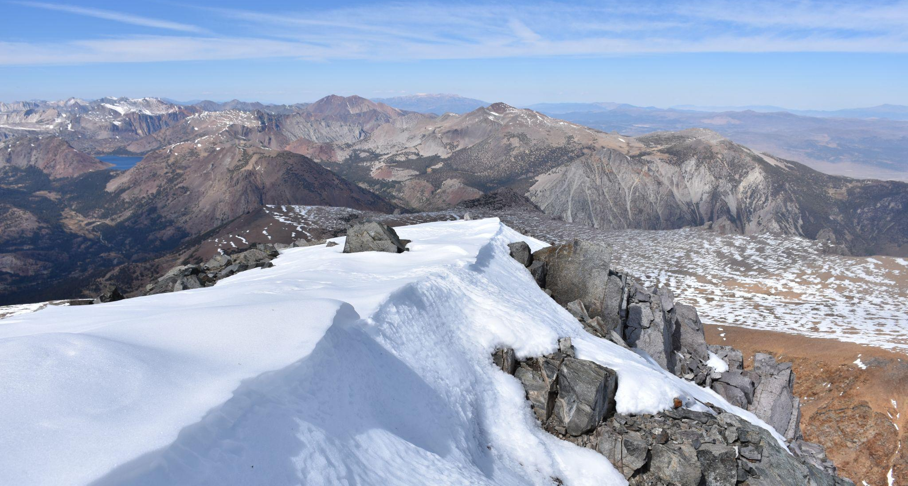
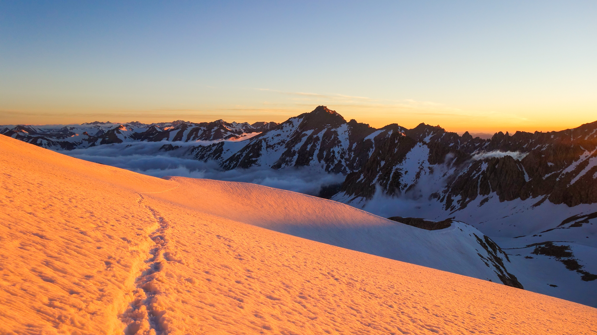

# Predicting Snowpack 
## in California’s Sierra Nevada Mountains

### Problem

  

Photo by Tilman Bayer

Estimation of snowfall in the Sierra Nevadas is critially important for the people of California and those who benefit from California agriculture. 75% of agricultural water supply across California are derived from precipitation and snow in the Sierra Nevadas.  

Current methods to estimate snow water equivalent (SWE) are lack representative geographic coverage or are expensive to conduct. For example, Snow Telemetry (SNOTEL) sites are an automated network of snowpack and related climate sensors. Although there is constant data due to it's automated nature, the distribution of SNOTEL sites are biased towards lower elevations and do not accurately reflect all areas of interest. Alternatively, the Airborne Snow Observatory (ASO) is a program to measure SWE through Light Detection and Ranging (lidar) and is the current gold standard for SWE estimations with it's ability to map entire regions through flyby missions. However ASO data collection is costly, sporadic, and in recent years has gone private.  

### The Impact

  

Photo by <a href="https://unsplash.com/@dnevozhai?utm_source=unsplash&utm_medium=referral&utm_content=creditCopyText">Denys Nevozhai</a> on <a href="https://unsplash.com/s/photos/sierra-nevada?utm_source=unsplash&utm_medium=referral&utm_content=creditCopyText">Unsplash</a>

Accurate estimates of snowfall is would provide a valuable tool for natural resource managements and policy makers, allowing for better usage recommendations. With the growing water crisis in the Western US, a tool like this can prove critical for minimizing negative impacts for the Central California Valley agriculture, and the people California who rely on it.

By creating a machine learning solution for generating these estimations from publicly available data, we hope to improve water management for the entire state of California at little to no cost. Our tool provides a free and comparable alternative to ASO surveys, but with continuous temporal coverage.

### The SnowCast Solution

  

Photo by <a href="https://unsplash.com/@sebastiengoldberg?utm_source=unsplash&utm_medium=referral&utm_content=creditCopyText">Sébastien Goldberg</a> on <a href="https://unsplash.com/s/photos/sierra-nevada?utm_source=unsplash&utm_medium=referral&utm_content=creditCopyText">Unsplash</a>

<a href="https://seiris21.github.io/ucb2022.snowcast/results/">Solution and Results</a>

We’ve created a prediction tool that uses free and available data sources to estimate snow water equivalent (SWE) in the Sierra Nevadas achieving a Root Mean Squared Error of 8” when compared to ASO measurements. Being able to accurately predict/estimate the SWE in the Sierra Nevadas is critical for water management, policy makers, and researchers. This need becomes more and more critical as the water crisis of the West Coast continues to grow. The ability to replace and/or supplement expensive and infrequent ASO flights is incredibly valuable to a wide range of individuals.

  

  
    <article class="post">
      <a href="{{ site.baseurl }}{{ post.url }}">
        <h1>{{ post.title }}</h1>

        

          
{{ post.date | date: "%B %e, %Y" }}

        

      </a>
      

        {{ post.excerpt }}
      

      <a href="{{ site.baseurl }}{{ post.url }}" class="read-more">Read More</a>
    </article>
  

  <!-- pagination -->
  
  

    
      <a href="{{ paginator.previous_page_path | prepend: site.baseurl | replace: '//', '/' }}">&laquo; Prev</a>
    
      &laquo; Prev
    

    
      
        {{ page }}
      
        <a href="{{ '/' | prepend: site.baseurl | replace: '//', '/' }}">{{ page }}</a>
      
        <a href="{{ site.paginate_path | prepend: site.baseurl | replace: '//', '/' | replace: ':num', page }}">{{ page }}</a>
      
    

    
      <a href="{{ paginator.next_page_path | prepend: site.baseurl | replace: '//', '/' }}">Next &raquo;</a>
    
      Next &raquo;
    
  

  

